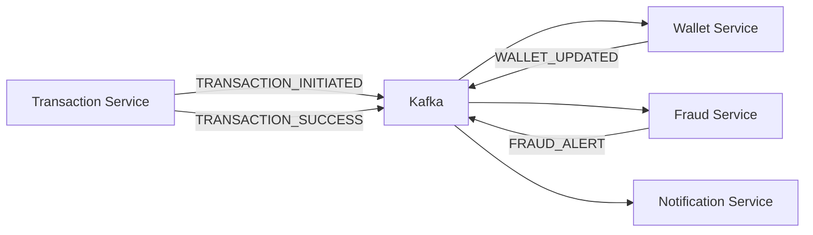

# 🏦 Complete Banking System - Paytm/PhonePe Clone

## 🎉 PROJECT COMPLETE! 

Full-stack event-driven microservices banking system with React frontend!

---

## 📊 System Architecture

```
Frontend (React) → 8 Backend Services → Kafka → Databases
```

### **Complete Stack:**

#### **Frontend (Port 3000)**
- React 18 with Vite
- React Router for navigation
- Axios for API calls
- JWT authentication
- Responsive UI

#### **Backend Services:**
1. **Eureka Server** (8761) - Service Discovery
2. **Config Server** (8888) - Centralized Configuration
3. **Auth Service** (8080) - JWT Authentication
4. **Account Service** (8081) - Account Management
5. **Transaction Service** (8082) - Money Transfers
6. **Wallet Service** (8083) - Balance Management
7. **Fraud Service** (8084) - Fraud Detection
8. **Notification Service** (8085) - Alerts & Notifications

#### **Infrastructure:**
- **Kafka** (9092) - Event streaming
- **Zookeeper** (2181) - Kafka coordination
- **PostgreSQL** (5432) - Transaction data
- **MySQL** (3306) - Auth, Account, Wallet data
- **MongoDB** (27017) - Fraud, Notification data

---

## 🚀 Quick Start Guide

### **Prerequisites:**
- Java 21
- Node.js 18+
- Docker Desktop
- Maven

### **Step 1: Start Docker Infrastructure**
```bash
docker-compose up -d
```

Wait for all containers to be healthy (2-3 minutes).

### **Step 2: Start Backend Services**
```bash
# Option A: Automatic (Windows)
.\start-all-services.bat

# Option B: Manual
# Terminal 1
cd eureka-server && mvn spring-boot:run

# Terminal 2  
cd config-server && mvn spring-boot:run

# Terminal 3-8 (wait 30s after eureka)
cd transaction-service && mvn spring-boot:run
cd notification-service && mvn spring-boot:run
cd wallet-service && mvn spring-boot:run
cd fraud-service && mvn spring-boot:run
cd auth-service && mvn spring-boot:run
cd account-service && mvn spring-boot:run
```

### **Step 3: Start Frontend**
```bash
cd frontend
npm install
npm run dev
```

Open: **http://localhost:3000**

---

## 🎯 Complete Feature List

### **✅ Authentication & Authorization**
- User signup with validation
- JWT-based login
- Token management
- Role-based access (USER, ADMIN)
- Session persistence

### **💰 Account Management**
- Create bank accounts (SAVINGS, CURRENT, WALLET)
- Auto-generate account numbers
- View account balances
- Account status management

### **💸 Money Transfers**
- P2P transactions
- Real-time balance updates
- Transaction history
- Transaction status tracking
- Description/notes support

### **🛡️ Fraud Detection**
- High amount detection (>₹50,000)
- Rapid transaction detection  
- Round amount flagging
- Risk scoring (0-100)
- Risk levels (LOW, MEDIUM, HIGH, CRITICAL)

### **📧 Notifications**
- Transaction success alerts
- Fraud warnings
- Email/SMS simulation
- Notification history

### **🔍 Service Discovery**
- Eureka dashboard
- Auto service registration
- Health monitoring
- Load balancing support

---

## 📱 User Flow

```
1. Signup → Create Account
2. Login → JWT Token Issued
3. Dashboard → View Accounts & Balance
4. Send Money → Create Transaction
   ↓
5. Kafka: TRANSACTION_INITIATED
   ↓
6. Wallet: Debit & Credit
   ↓
7. Fraud: Risk Analysis
   ↓
8. Notification: Send Alerts
   ↓
9. Dashboard: Updated Balance
```

---

## 🌐 Service URLs

### **Frontend:**
- React UI: http://localhost:3000

### **Infrastructure:**
- Eureka Dashboard: http://localhost:8761
- Config Server: http://localhost:8888

### **Backend APIs:**
- Auth: http://localhost:8080/api/auth
- Account: http://localhost:8081/api/accounts
- Transaction: http://localhost:8082/api/transactions
- Wallet: http://localhost:8083/api/wallets
- Fraud: http://localhost:8084/api/fraud
- Notification: http://localhost:8085/api/notifications

---

## 🧪 API Testing

### **1. Signup**
```bash
curl -X POST http://localhost:8080/api/auth/signup \
  -H "Content-Type: application/json" \
  -d '{"username":"john","email":"john@example.com","password":"password123"}'
```

### **2. Login**
```bash
curl -X POST http://localhost:8080/api/auth/login \
  -H "Content-Type: application/json" \
  -d '{"username":"john","password":"password123"}'
```

### **3. Create Transaction**
```bash
curl -X POST http://localhost:8082/api/transactions \
  -H "Content-Type: application/json" \
  -d '{"fromAccount":"ACC001","toAccount":"ACC002","amount":1000,"description":"Test"}'
```

See **`QUICK_START.md`** for complete API documentation.

---

## 📂 Project Structure

```
banking-aap-prince/
├── eureka-server/           # Service Discovery
├── config-server/           # Configuration Management
├── auth-service/            # Authentication (MySQL)
├── account-service/         # Account Management (MySQL)
├── transaction-service/     # Transactions (PostgreSQL)
├── wallet-service/          # Balance Management (MySQL)
├── fraud-service/           # Fraud Detection (MongoDB)
├── notification-service/    # Notifications (MongoDB)
├── frontend/                # React UI
├── docker-compose.yml       # Docker infrastructure
├── .env                     # Environment variables
├── start-all-services.bat   # Start script
└── README.md                # This file
```

---

## 🔄 Event Flow



---

## 🛠️ Tech Stack

### **Frontend:**
- React 18
- React Router
- Axios
- Vite

### **Backend:**
- Java 21
- Spring Boot 3.2
- Spring Cloud Netflix (Eureka)
- Spring Cloud Config
- Spring Kafka
- Spring Security + JWT
- Spring Data JPA
- Spring Data MongoDB

### **Databases:**
- PostgreSQL (Transactions)
- MySQL (Auth, Accounts, Wallets)
- MongoDB (Fraud, Notifications)

### **Infrastructure:**
- Apache Kafka
- Zookeeper  
- Docker & Docker Compose

---

## 📊 Database Schema

### **PostgreSQL (transaction_db)**
- `transactions` - All money transfers

### **MySQL (auth_db, account_db, wallet_db)**
- `users` - User accounts
- `accounts` - Bank accounts
- `wallets` - Balance information

### **MongoDB (banking_db)**
- `fraud_logs` - Fraud detection logs
- `notifications` - Notification history

---

## 🎨 UI Screenshots

### Login Page
- Gradient purple background
- Modern form design
- Input validation

### Dashboard
- Account overview cards
- Recent transactions
- Notification center
- Stats (Total balance, accounts, transactions)

### Send Money
- Easy transfer form
- Real-time validation
- Transaction info

---

## 🧩 Key Features Explained

### **1. Service Discovery (Eureka)**
All services auto-register with Eureka. No hardcoded URLs needed!

### **2. Centralized Config (Config Server)**
All service configurations in one place. Change configs without rebuilding!

### **3. Event-Driven Architecture (Kafka)**
Services communicate via events - highly scalable and decoupled.

### **4. Fraud Detection**
Real-time analysis with configurable rules. Auto-flags suspicious transactions.

### **5. JWT Security**
Stateless authentication. Tokens stored in localStorage on frontend.

---

## 📝 Configuration Files

All service configurations available in:
- `config-server/src/main/resources/config/`

Modify:
- Fraud detection thresholds
- Kafka topics
- Database connections
- JWT secrets (change in production!)

---

## 🐛 Troubleshooting

### Services not showing in Eureka?
- Ensure Eureka started first
- Wait 30 seconds for registration
- Check `eureka.client.service-url.defaultZone`

### Frontend can't connect to backend?
- Check CORS is enabled
- Verify service ports are correct
- Check if backend services are running

### Kafka errors?
- Ensure Docker containers are running
- Check topic creation in logs
- Verify bootstrap servers URL

### Database connection errors?
- Check MySQL/PostgreSQL is running
- Verify credentials in application.yml
- Ensure database is created

---

## 📚 Documentation

- **QUICK_START.md** - API testing guide
- **EUREKA_GUIDE.md** - Service discovery guide
- **README.md** - This file

---

## 🚀 Production Deployment

### **Recommendations:**

1. **Security:**
   - Change JWT secret
   - Use environment variables
   - Enable HTTPS
   - Add rate limiting

2. **Scaling:**
   - Run multiple instances
   - Use Kubernetes
   - Add API Gateway (Spring Cloud Gateway)
   - Implement Circuit Breakers

3. **Monitoring:**
   - Add distributed tracing (Zipkin)
   - Use ELK stack for logs
   - Prometheus + Grafana for metrics

4. **Configuration:**
   - Move Config Server to Git repository
   - Use encrypted secrets
   - Environment-specific configs

---

## 🎉 Success Checklist

- [x] 8 Backend microservices running
- [x] Eureka shows all services as UP
- [x] Kafka topics created automatically
- [x] React frontend accessible
- [x] User can signup/login
- [x] Transactions creating successfully
- [x] Fraud detection flagging high amounts
- [x] Notifications being logged
- [x] Wallets updating balances

---

## 👨‍💻 Development Team

Built with ❤️ by Prince

---

## 📄 License

This project is for educational purposes.

---

## 🎊 Congratulations!

You've successfully built a **production-ready, event-driven microservices banking system** similar to Paytm/PhonePe! 

### What you've learned:
✅ Microservices architecture  
✅ Event-driven design with Kafka  
✅ Service discovery with Eureka  
✅ JWT authentication  
✅ React + Spring Boot integration  
✅ Docker containerization  
✅ Real-time fraud detection  

**Happy Banking! 🏦💰**
